# SQL13

## 1) Affichez tous les employés
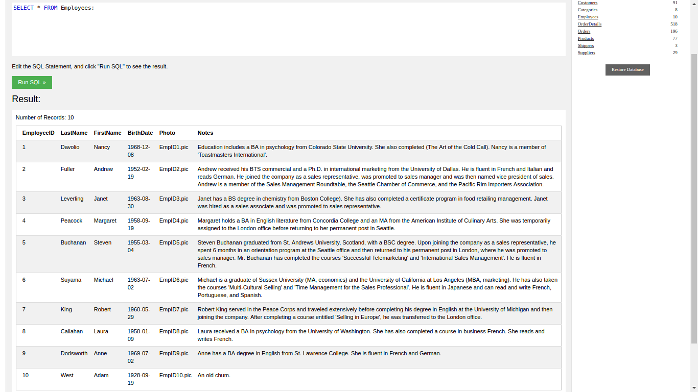

## 2) Affichez uniquement les ProductID et les ProductName de la table product
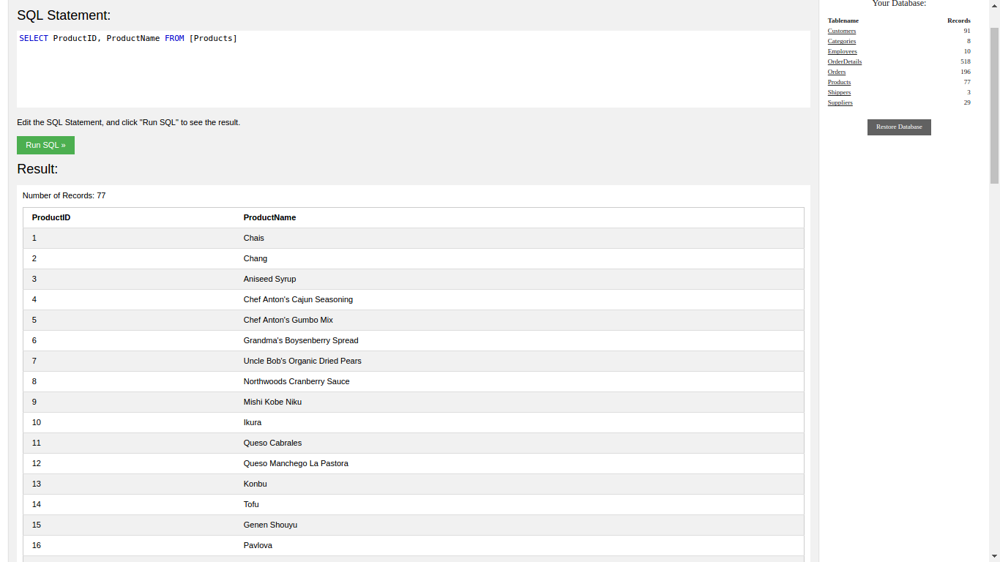

## 4) Affichez les Orders du client "Around the Horn"
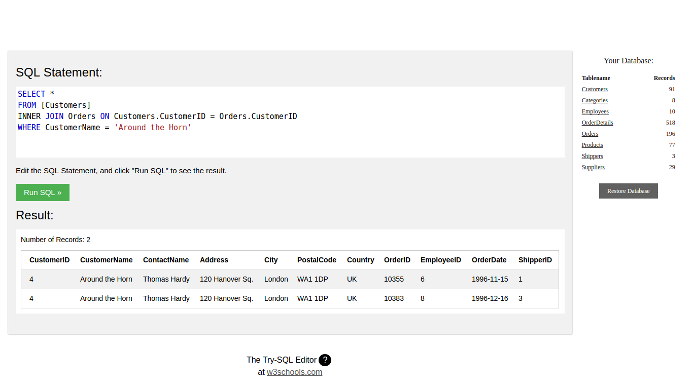

## 5) Affichez les détails des commandes du client "B's Beverages"
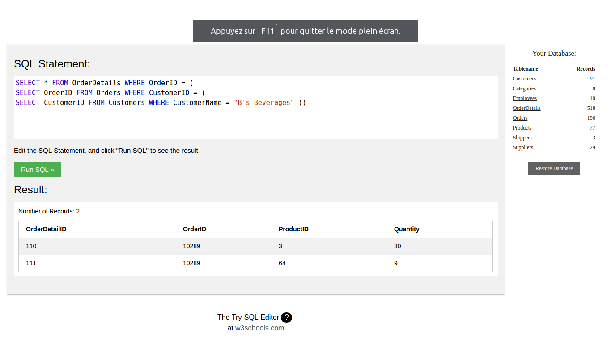

## 6) Ajoutez vos infos dans la table des employés
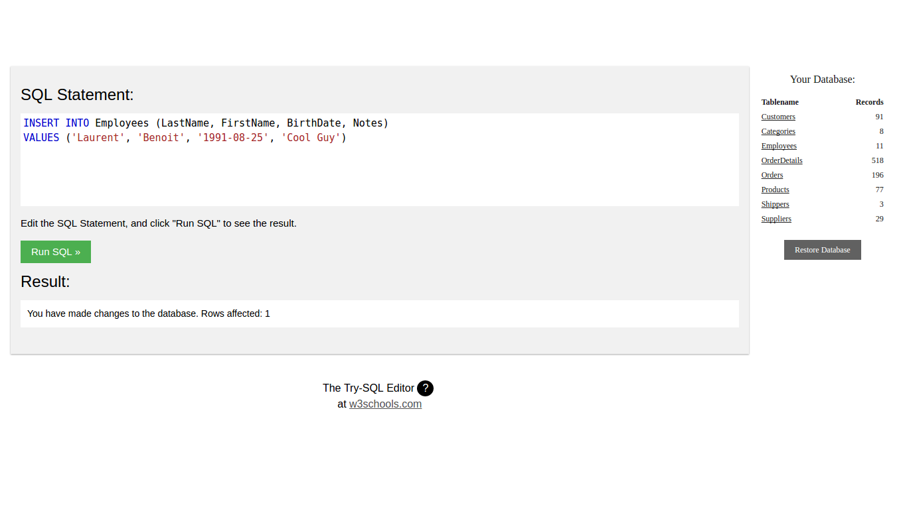

## 7) Ajoutez un champ pour un nouveau collègue fictif dans la table des employés, mais attention, celui-ci refuse de mettre sa photo
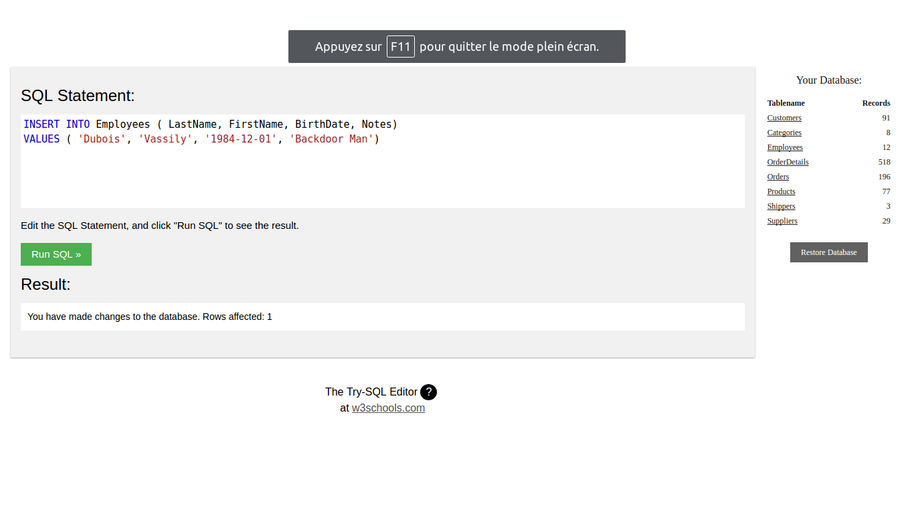

## 8) Il y a une faute de frappe dans le numéro de téléphone du Shipper "Federal shipping", le bon est le : (503) 555-9935. Mettez ses données à jour
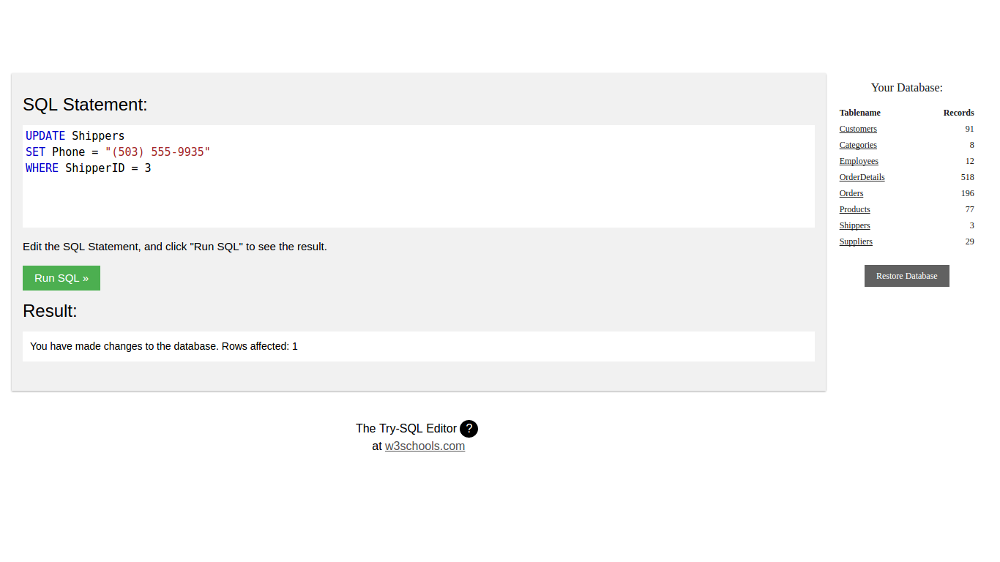

## 9) Nous venons de perdre le client "Du monde entier" supprimez manuellement toutes les infos le concernant dans notre BDD (les commandes, les détails de commandes et ses infos de clients)
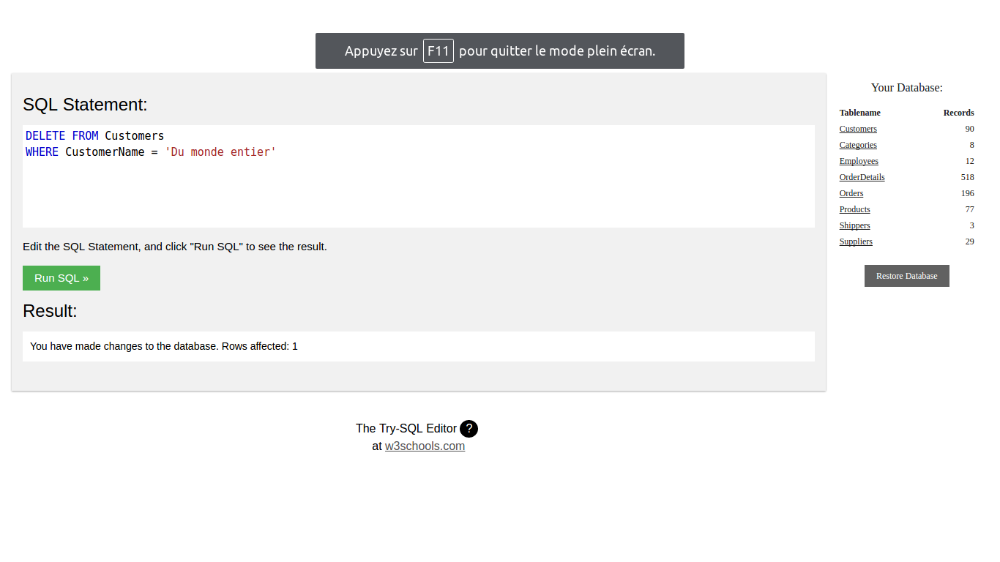

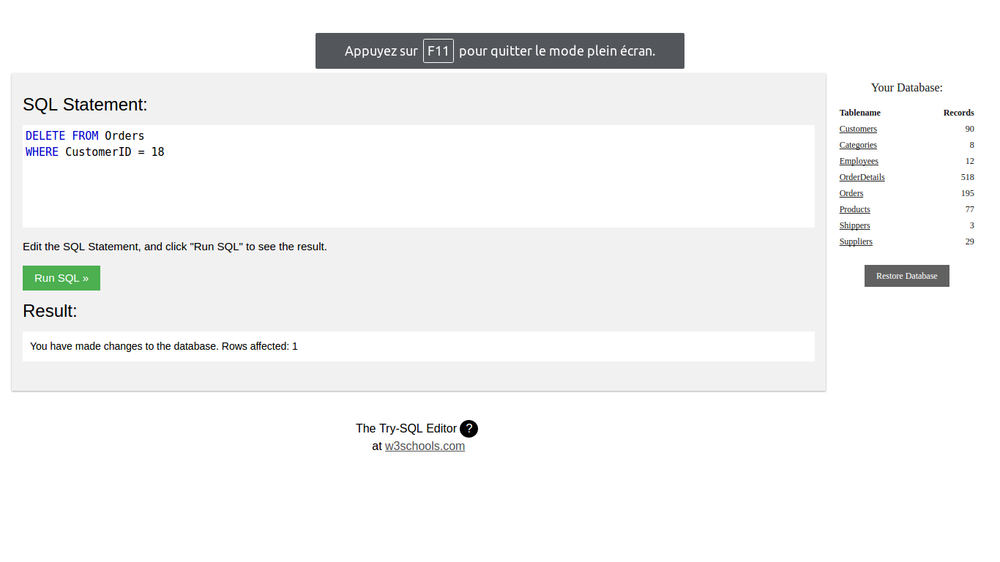

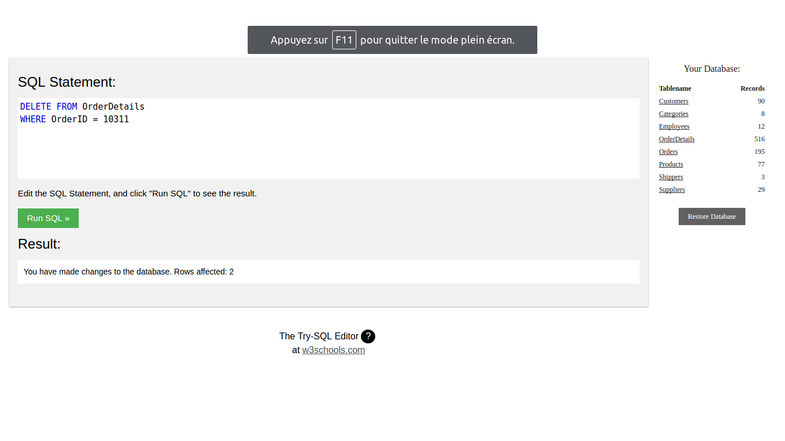

## 10) Donnez le prix moyen de leurs produits
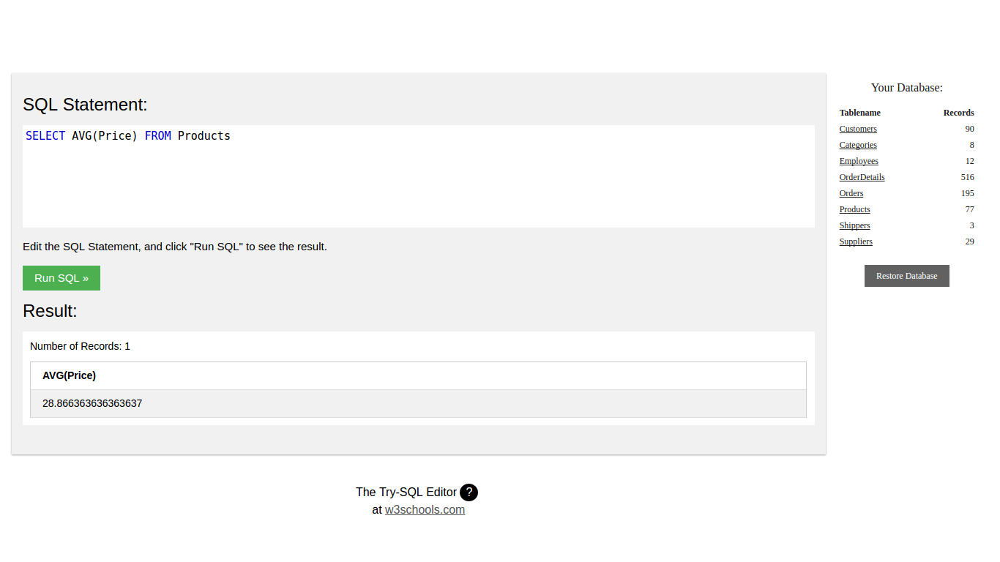

## 11) Faîtes une requête qui affiche dans une nouvelle colonne (attention, cela ne veut pas dire en insérer une nouvelle) le total dépensé dans chaque commande dans la table OrderDetails.
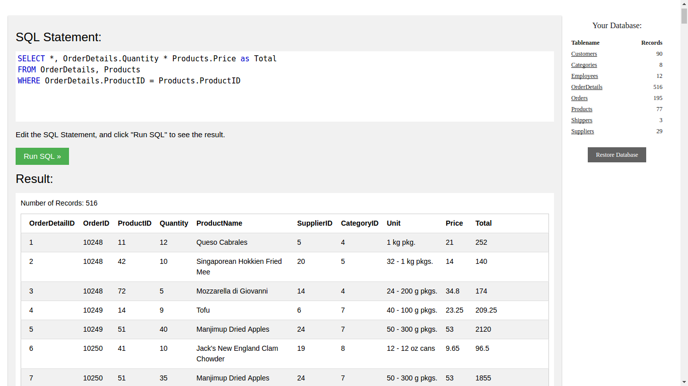

## 12) Affichez le produit "vache à lait" c.a.d. le produit qui a le chiffre d'affaires le plus important

